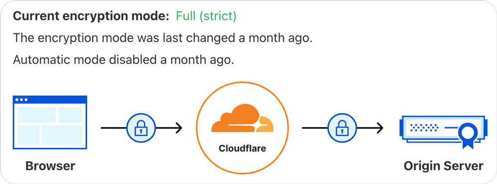
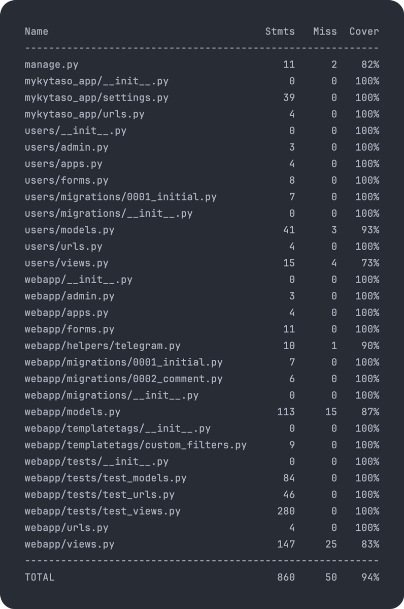
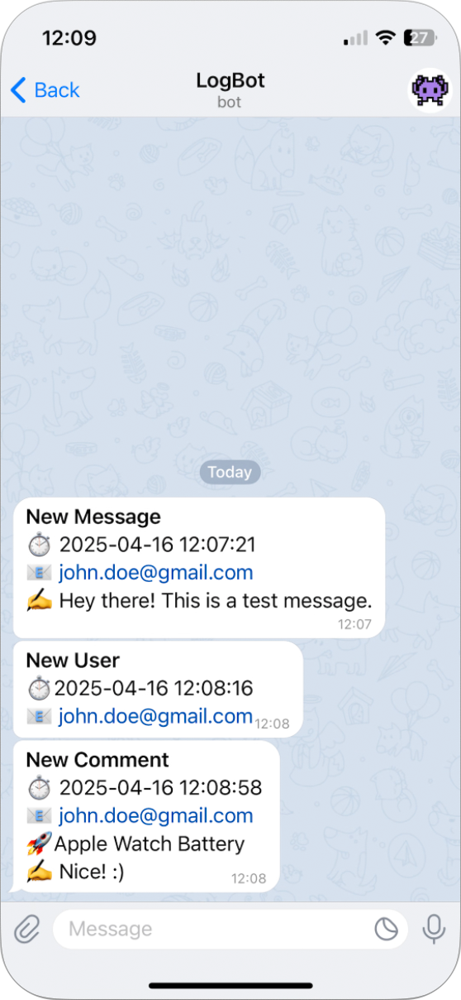
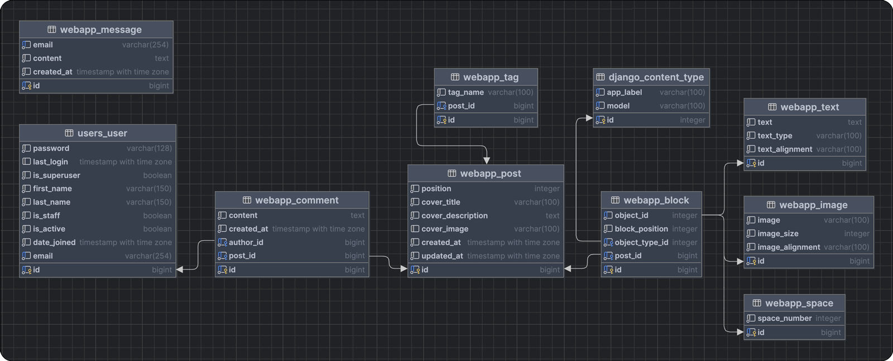
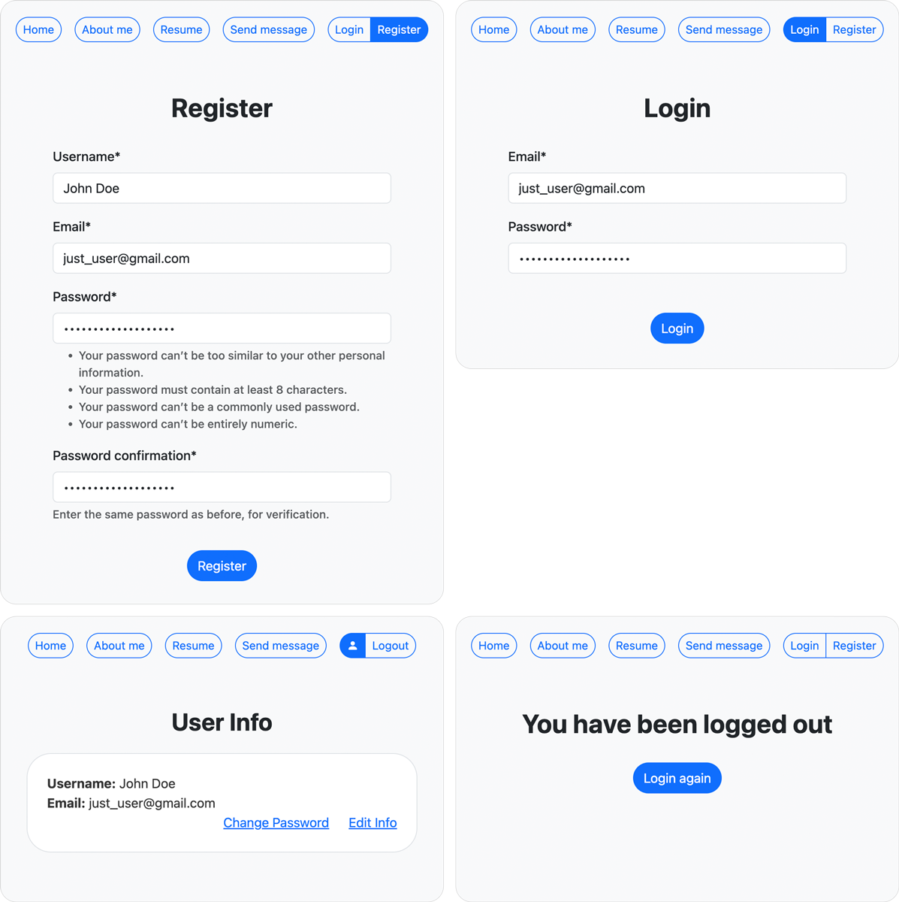
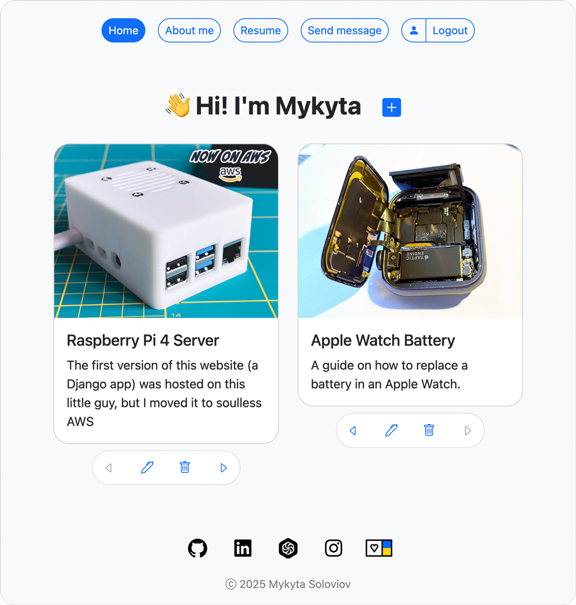
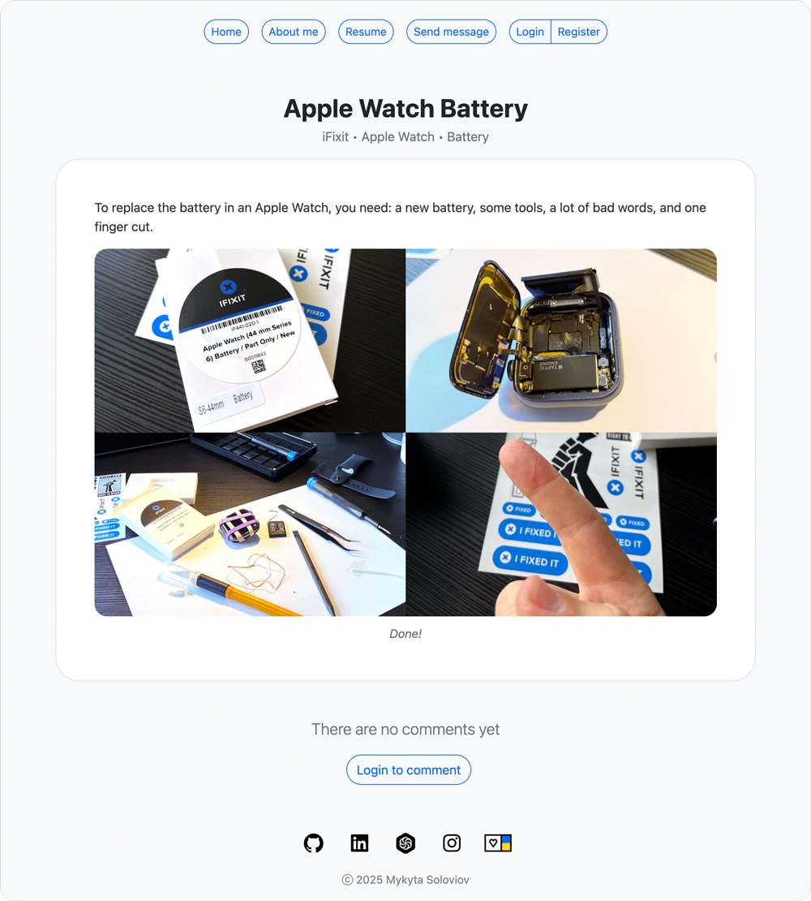
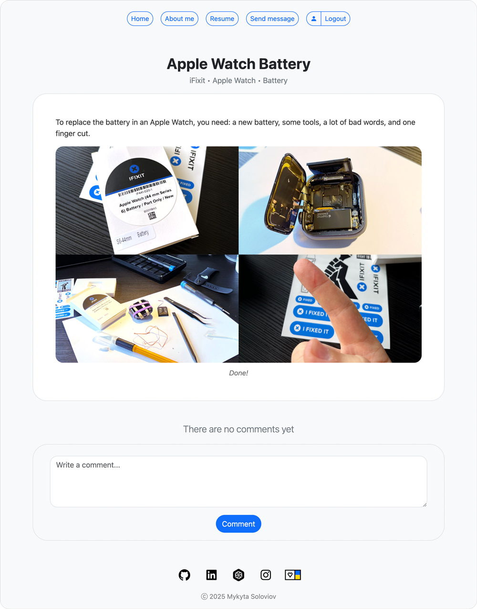
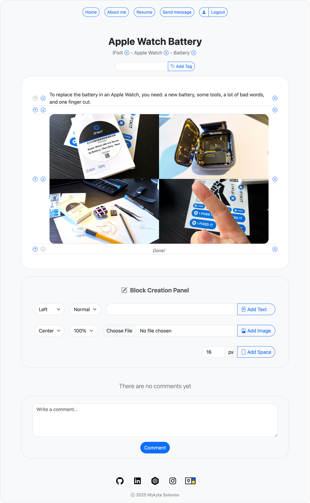
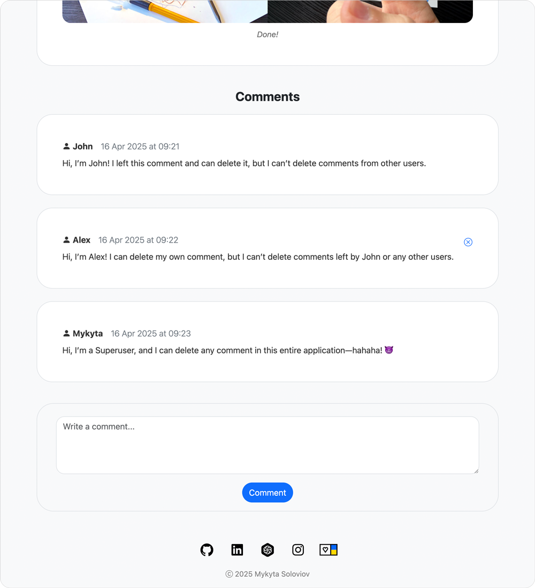

# 👾 mykytaso.com

## My Django-based blog running on AWS

**Key Features:**
- Content creation using customizable blocks (inspired by Notion’s block-based system)
- Email-based user registration
- Commenting for authenticated users
- Real-time Telegram notifications

 

Quick video overview available on **[YouTube](https://youtu.be/cOzc9Wddsk8)**

 

## Technologies

- **Django 5.2**
- **PostgreSQL 17.2**
- **Django Signals** – Used for deleting media files from AWS S3 Bucket and sending Telegram notifications
- **GenericForeignKey** – Allows each Block to represent a different type of content, like text, image, or space
- **HTML, CSS, Bootstrap 5.3, Django Template Language (DTL)**
- **AWS, NGINX, Gunicorn**

 

## Deployed on AWS

### 🔗 [mykytaso.com](https://mykytaso.com)

The application is fully deployed on AWS using the following services: 
- **EC2** – Hosts the Ubuntu server running the application with NGINX and Gunicorn
- **RDS** – Handles the PostgreSQL database
- **S3 Bucket** – Stores uploaded media files
- **CloudFront** – Delivers media files from the S3 Bucket

 

## SSL/TLS (HTTPS)
Secure HTTPS is enabled using SSL/TLS certificates provided by `Let’s Encrypt`, managed via `Certbot`.

 

## Unit and Integration Testing
I implemented extensive unit and integration tests with `Unittest`. 
Current test coverage is **94%**.

 

## Telegram Notification Bot
The application features a Telegram bot that sends notifications for:
- New messages
- User registrations
- New comments on posts

 

## Database Diagram

 

## Functionality overview

### Registration and Login
Registration is **email-based**. 
Only registered users can leave comments on posts.

 

### Posts List Page (Homepage)
**Anonymous** and **Authenticated** users see this basic view:

 

**Superusers** see additional features:
- A `+` button to create a new post.
- A **tool panel** under each post with:
  - `arrows buttons` (to reorder posts)
  - `edit button`
  - `delete button`

 

### Post Detail Page (Post Content Page)
**Anonymous** users can view comments but must log in to leave one:

 

**Authenticated** users can leave comments using the `comment form`.

 

**Superusers** have access to the `Block Creation Panel`, enabling them to create post content using `blocks`. 
They can also reorder `blocks` using **up** or **down** `arrow buttons`, and remove `blocks` with the `delete button`. 
I was inspired by Notion’s block-based system and wanted to implement a similar approach. 

Available `block` types (each with customization options):
- Text
- Image
- Space

**Superusers** can also add `tags` just below the post title. When multiple `tags` are present, they’re separated by a `•` symbol for better readability.

 

### Comments
**Authenticated** users can comment and **delete their own comments**. 
**Superusers** can **delete any** comment across the entire application.

For example, **Alex** is authenticated and can see the delete button for his own comment:

 

## ✍️ &nbsp; Author
 Mykyta Soloviov <a href="https://github.com/mykytaso">@mykytaso</a>
